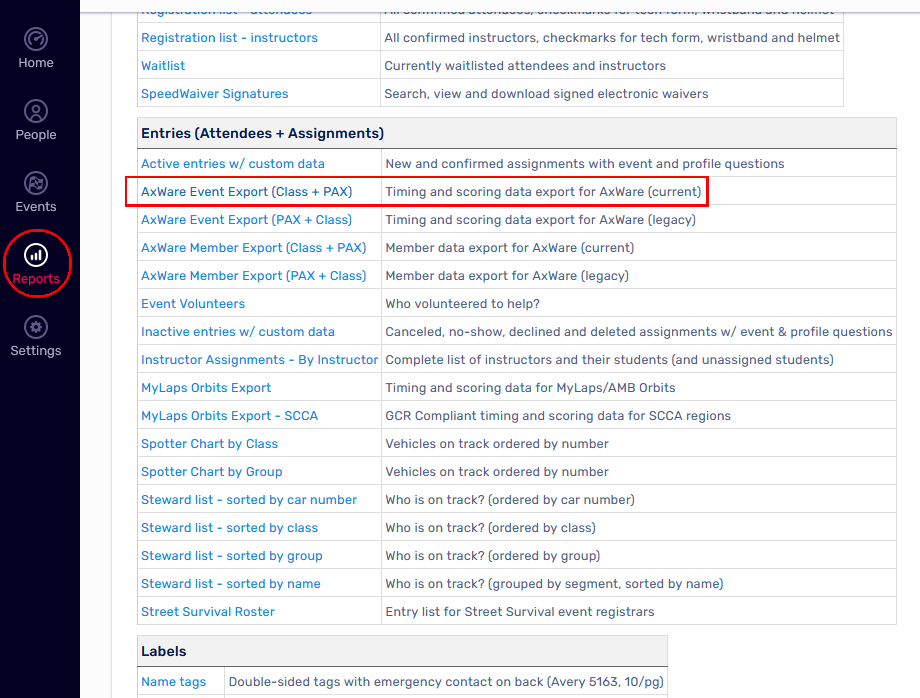
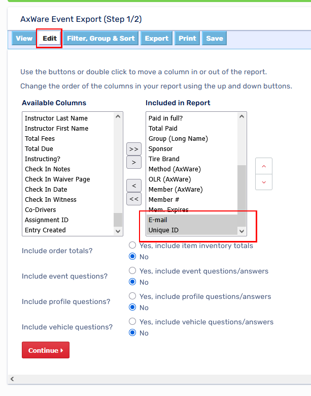
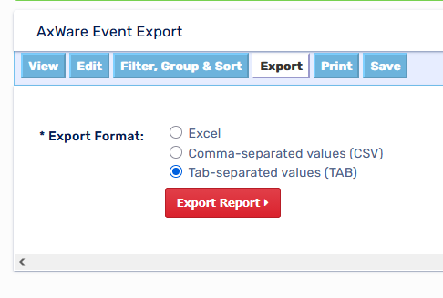
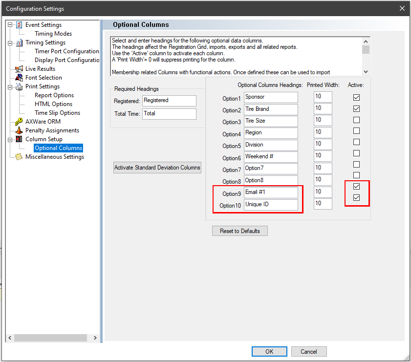
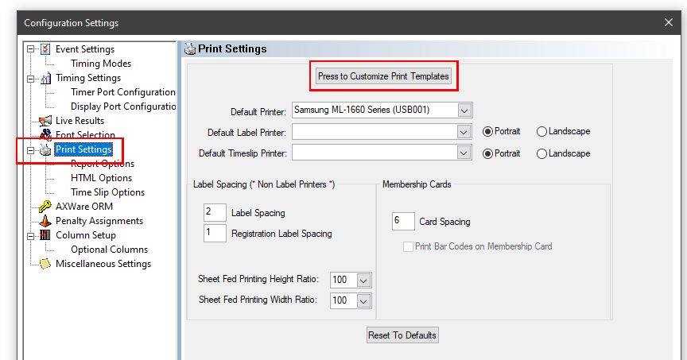
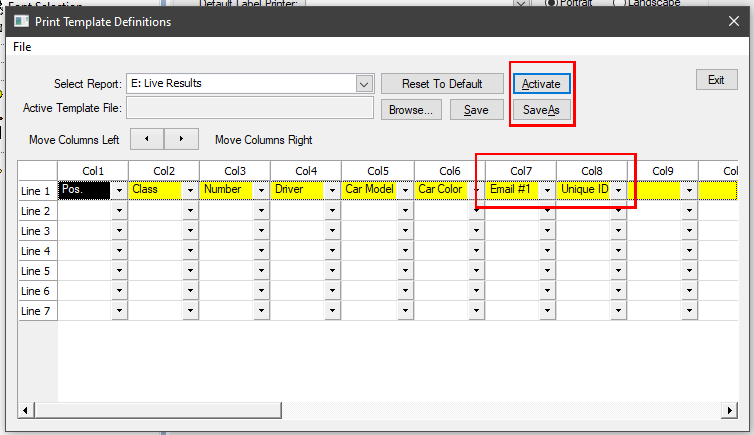

# MotorsportReg and AxWare Event Setup

## MotorsportReg Event Export

1. From the MSR Organizer page, enter the `Reports` section, then choose the `Axware Event Export (Class + PAX)` entry from the `Entries (Attendies + Assignments)` section (Note: the `AxWare Member Export (Class + PAX)` option is also acceptable).  
    

1. Use the `Edit` section of the export process to ensure the `E-mail` and `Unique ID` fields are included in the report  
    

1. Export the entry list in `Tab-separated values (TAB)` format.  
    

## AxWare Pre-Event Import Setup

1. Before importing the entry list, make sure to define and activate the following optional columns in the AxWare `Setup -> Options -> Column Setup -> Optional Columns` dialog. Note that these must be typed in _**exactly**_ as written below. The position within the optional columns is not important:
    * `Email #1`
    * `Unique ID`  

    

## AxWare Live Results Export Setup

1. In the `Setup -> Options -> Print Settings` dialog, press the `Press to Customize Print Templates` button

1. In the customization dialog, select `E: Live Results`

1. Ensure the `Email #1` and `Unique ID` columns are selected. The order/position of these columns is not important. The `Sponsor` column is also accepted by Race Results.

1. `Save As` and `Activate` the live results template file before closing the dialog

